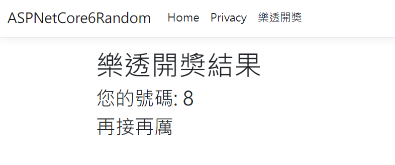
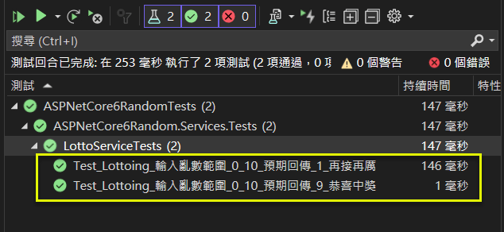

## 非決定性元素 (Non-Deterministic Elements) 的單元測試
Unit Test for Non-Deterministic Elements in ASP.NET Core 6 MVC   

## 前言

非決定性元素 (Non-Deterministic Elements) 是指在軟體開發中, 其行為或輸出無法預先確定或不會每次都產生相同結果的元素.  
這種不確定性通常是由於外部因素, 隨機性, 系統狀態或執行環境的變化所引起.  
**非決定性元素在測試時可能帶來挑戰, 因為相同的輸入不一定導致相同的輸出.**  

以下是一些常見的非決定性元素範例:  

* 隨機數生成 (如 Random 類別):  隨機數生成器產生的數字是不可預測的, 每次調用可能得到不同的結果.  
* GUID 生成 (如 Guid.NewGuid()) : 全局唯一標識符 (GUID) 生成器每次調用時都會產生一個唯一的值.  
* 當前日期和時間 (如 DateTime.Now) : 當前的日期和時間在每次調用時都會不同, 這取決於當前的系統時間.  

**在單元測試中處理非決定性元素時, 一個常用的策略是通過封裝 (Wrapping) 這些元素於可控的介面後, 使用模擬或替身物件 (Test Doubles) 來提供可預測的輸出. 這樣可以減少測試的不確定性, 並提高測試的可靠性和重複性.**   

以下茲以一個 ASP.NET Core 6 MVC 的專案, 以 Random 類別為例, 進行演練.  

## 演練細節

### 步驟_1: 建立 ASP.NET Core 6 MVC 專案
採用 Visual Studio 2022 建立 ASP.NET Core 6 MVC 專案.  

### 步驟_2: 加入 IRandomGenerator 介面 及 RandomGenerator 類別

**以下為 Random 的類別原型, 並未有實作任何的介面, 無法抽象化; 故自行定義一個介面 (interface) 將其重新包裝使用.**  

```csharp
namespace System;
public class Random
{
	public Random();
	public Random(int Seed);
	public static Random Shared { get; }
	public virtual int Next();
	public virtual int Next(int maxValue);
	public virtual int Next(int minValue, int maxValue);
	public virtual void NextBytes(byte[] buffer);
	public virtual void NextBytes(Span<byte> buffer);
	public virtual double NextDouble();
	public virtual long NextInt64();
	public virtual long NextInt64(long maxValue);
	public virtual long NextInt64(long minValue, long maxValue);
	public virtual float Nextsingle();
	protected virtual double Sample();
}
```

**以下只抽出 Random 類別的常用方法, 並沒有包含全部.**  

```csharp
// 定義介面
public interface IRandomGenerator
{
	int Next();
	int Next(int maxValue);
	int Next(int minValue, int maxValue);
	double NextDouble();
}
```

```csharp
// 實作介面
public class RandomGenerator : IRandomGenerator
{
	private readonly Random _random = new();

	public int Next() => _random.Next();
	public int Next(int maxValue) => _random.Next(maxValue);
	public int Next(int minValue, int maxValue) => _random.Next(minValue, maxValue);
	public double NextDouble() => _random.NextDouble();
}
```

### 步驟_3: 加入 LottoController, LottoService, LottoViewModel, Lotto/Index.cshtml, 以處理樂透開獎的功能.

```csharp
// 建立 LottoController
public class LottoController : Controller
{
	private readonly ILottoService _lottoService;

	public LottoController(ILottoService lottoService)
	{
		_lottoService = lottoService;
	}

	public IActionResult Index()
	{
		var result = _lottoService.Lottoing(0, 10);
		return View(result);
	}
}
```

```csharp
// 定義 ILottoService 介面
public interface ILottoService
{
	LottoViewModel Lottoing(int min, int max)
}

// 實作 ILottoService 介面
public class LottoService : ILottoService
{
	private readonly IRandomGenerator _randomGenerator;

	public LottoService(IRandomGenerator randomGenerator) 
	{
		_randomGenerator = randomGenerator;
	}

	public LottoViewModel Lottoing(int min, int max)
	{
		var result = new LottoViewModel();

		// Random(min, max): 含下界, 不含上界
		var yourNumber = _randomGenerator.Next(min, max);
		// 只要餘數是 9, 就代表中獎
		var message = (yourNumber % 10 == 9) ? "恭喜中獎" : "再接再厲";

		result.YourNumber = yourNumber;
		result.Message = message;

		return result;
	}
}
```

```html
<!-- Index.cshtml  -->
@model  ASPNetCore6Random.ViewModels.LottoViewModel

@{
    ViewData["Title"] = "樂透開奬結果";
}

<h1>樂透開奬結果</h1>

<h3>您的號碼: @Model.YourNumber </h3>
<h3> @Model.Message </h3>
```

### 步驟_4: 修訂 _Layout.cshtml, 掛上 樂透開獎 至選單.

```html
<li class="nav-item">
	<a class="nav-link text-dark" asp-area="" asp-controller="Lotto" asp-action="Index">樂透開獎</a>
</li>
```

### 步驟_5:  將相關的 service 或功能, 註冊至 DI

```csharp
#region 註冊相關的服務
builder.Services.AddSingleton<IRandomGenerator, RandomGenerator>();
builder.Services.AddScoped<ILottoService, LottoService>();
#endregion
```

### 步驟_6: 確認一下執行的結果
* 未中獎 
  *    
* 中獎 
  *    


### 步驟_7: 建立單元測試案例

針對 LottoService 的 Lotting(int min, int max) 方法, 撰寫單元測試.  

會用到 2 個套件:  
(1) Moq 4.18.4: 一個常用的 Mock 套件.   
重要: 自 4.20.0 起, 有一些安全的議題要考量, 所以採用 4.18.4 的版本.  
* <a href="https://medium.com/@michalsitek/critical-security-vulnerability-in-moq-4-20-0-ffd24739cc49" target="_blank">Critical security vulnerability in Moq 4.20.0</a>

(2) ExpectedObjects 3.5.4: 用以在單元測試中, 驗證 2 個物件是否相等.  

以下主要針對實作 ILottoService 介面實體 (LottoService) 的 Lotting(int min, int max) 方法撰寫單元測試案例.  

LottoService 的建構子, 需要傳入一個實作 IRandomGenerator 的物件, 故我們可以製作一個 mock 的物件, 控制 LottoService 在呼叫 _randomGenerator.Next(min, max) 的回傳值.  

* 第1個案例為: 輸入亂數範圍_0_10_預期回傳_9_恭喜中獎.
* 第2個案例為: 輸入亂數範圍_0_10_預期回傳_1_再接再厲.

以中文描述測試情境, 這樣才容易理解測試目的.  

```csharp
[TestMethod()]
public void Test_Lottoing_輸入亂數範圍_0_10_預期回傳_9_恭喜中獎()
{
	// Arrange
	var expected = new LottoViewModel()
	{ YourNumber = 9, Message = "恭喜中獎" }
				.ToExpectedObject();

	int fixedValue = 9;
	var mockRandomGenerator = new Mock<IRandomGenerator>();
	mockRandomGenerator.Setup(r => r.Next(It.IsAny<int>(), It.IsAny<int>())).Returns(fixedValue);

	// Act
	var target = new LottoService(mockRandomGenerator.Object);
	var actual = target.Lottoing(0, 10);

	// Assert
	expected.ShouldEqual(actual);
}
```

```csharp
public void Test_Lottoing_輸入亂數範圍_0_10_預期回傳_1_再接再厲()
{
	// Arrange
	var expected = new LottoViewModel()
	{ YourNumber = 1, Message = "再接再厲" }
				.ToExpectedObject();

	int fixedValue = 1;
	var mockRandomGenerator = new Mock<IRandomGenerator>();
	mockRandomGenerator.Setup(r => r.Next(It.IsAny<int>(), It.IsAny<int>())).Returns(fixedValue);

	// Act
	var target = new LottoService(mockRandomGenerator.Object);
	var actual = target.Lottoing(0, 10);

	// Assert
	expected.ShouldEqual(actual);
}
```

### 步驟_8: 檢查測試的結果

  

## 結論

本文以非決定性元素 (Non-Deterministic Elements) 中的 Random 類別為範例, 在 ASP.NET Core 6 MVC 專案, 針對 Service 層實作了單元測試.  

**總算實際體驗了一下打包 (Wrap) 的過程, 這個方式主要用在解決必須 "直接相依耦合" 的情境, 但也會造成開發員要習慣使用打包後的介面及類別, 這是比較美中不足的地方.**   

或許有更好的處理方式, 只是受限筆者的能力, 無法作到盡善盡美, 但至少可以供參考.  

## 參考文件

* <a href="https://learn.microsoft.com/en-us/dotnet/api/system.random?view=net-6.0" target="_blank">(Microsoft) Random Class</a>  

