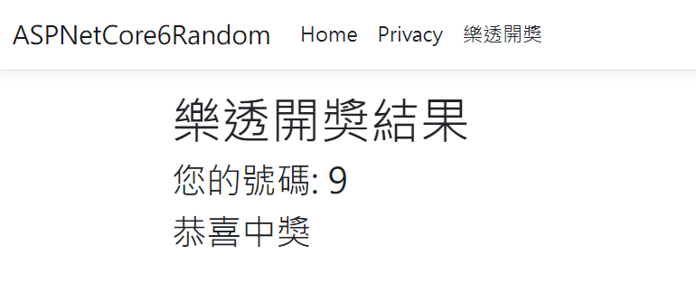

## 非決定性元素 (Non-Deterministic Elements) 的單元測試
Unit Test for Non-Deterministic Elements in ASP.NET Core 6 MVC   

## 前言

非決定性元素 (Non-Deterministic Elements) 是指在軟體開發和計算機科學中, 其行為或輸出無法預先確定或不會每次都產生相同結果的元素.  
這種不確定性通常是由於外部因素, 隨機性, 系統狀態或執行環境的變化所引起.  
**非決定性元素在測試和調試時可能帶來挑戰, 因為相同的輸入不一定導致相同的輸出.**  

以下是一些常見的非決定性元素範例:  

* 隨機數生成 (如 Random 類別):  隨機數生成器產生的數字是不可預測的, 每次調用可能得到不同的結果.  
* 當前日期和時間 (如 DateTime.Now) : 當前的日期和時間在每次調用時都會不同, 這取決於當前的系統時間.  
* GUID 生成 (如 Guid.NewGuid()) : 全局唯一標識符 (GUID) 生成器每次調用時都會產生一個唯一的值.  

**在單元測試中處理非決定性元素時, 一個常用的策略是通過封裝這些元素於可控的介面後, 使用模擬或替身物件來提供可預測的輸出. 這樣可以減少測試的不確定性, 並提高測試的可靠性和重複性.**   

以下茲以一個 ASP.NET Core 6 MVC 的專案, 以 Random 類別為例, 進行演練.  

## 演練細節

### 步驟_1: 建立 ASP.NET Core 6 MVC 專案
採用 Visual Studio 2022 建立 ASP.NET Core 6 MVC 專案.  

### 步驟_2: 加入 IRandomGenerator 介面 及 RandomGenerator 類別

```csharp
// 定義介面
public interface IRandomGenerator
{
	int Next();
	int Next(int maxValue);
	int Next(int minValue, int maxValue);
	double NextDouble();
}
```

```csharp
// 實作介面
public class RandomGenerator : IRandomGenerator
{
	private readonly Random _random = new();

	public int Next() => _random.Next();
	public int Next(int maxValue) => _random.Next(maxValue);
	public int Next(int minValue, int maxValue) => _random.Next(minValue, maxValue);
	public double NextDouble() => _random.NextDouble();
}
```

### 步驟_3: 加入 LottoController, LottoService, LottoViewModel, Lotto/Index.cshtml, 以處理樂透開獎的功能.

```csharp
// 建立 LottoController
public class LottoController : Controller
{
	private readonly ILottoService _lottoService;

	public LottoController(ILottoService lottoService)
	{
		_lottoService = lottoService;
	}

	public IActionResult Index()
	{
		var result = _lottoService.Lottoing();
		return View(result);
	}
}
```

```csharp
// 定義 ILottoService 介面
public interface ILottoService
{
	LottoViewModel Lottoing();
}

// 實作 ILottoService 介面
public class LottoService : ILottoService
{
	private readonly IRandomGenerator _randomGenerator;

	public LottoService(IRandomGenerator randomGenerator) 
	{
		_randomGenerator = randomGenerator;
	}

	public LottoViewModel Lottoing()
	{
		var result = new LottoViewModel();

		// Random(min, max): 含下界, 不含上界
		var yourNumber = _randomGenerator.Next(0, 10);
		var message = (yourNumber == 9) ? "恭喜中獎" : "再接再厲";

		result.YourNumber = yourNumber;
		result.Message = message;

		return result;
	}
}
```

```html
<!-- Index.cshtml  -->
@model  ASPNetCore6Random.ViewModels.LottoViewModel

@{
    ViewData["Title"] = "樂透開奬結果";
}

<h1>樂透開奬結果</h1>

<h3>您的號碼: @Model.YourNumber </h3>
<h3> @Model.Message </h3>
```

### 步驟_4: 修訂 _Layout.cshtml, 掛上 樂透開獎 至選單.

```html
<li class="nav-item">
	<a class="nav-link text-dark" asp-area="" asp-controller="Lotto" asp-action="Index">樂透開獎</a>
</li>
```

### 步驟_5:  將相關的 service 或功能, 註冊至 DI

```csharp
#region 註冊相關的服務
builder.Services.AddSingleton<IRandomGenerator, RandomGenerator>();
builder.Services.AddScoped<ILottoService, LottoService>();
#endregion
```

### 步驟_6: 確認一下執行的結果
* 未中獎 
  *    
* 中獎 
  *    


